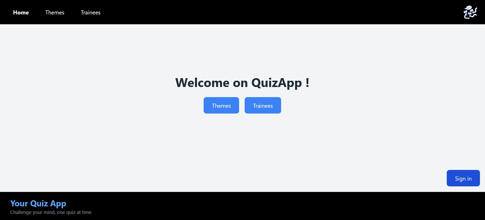
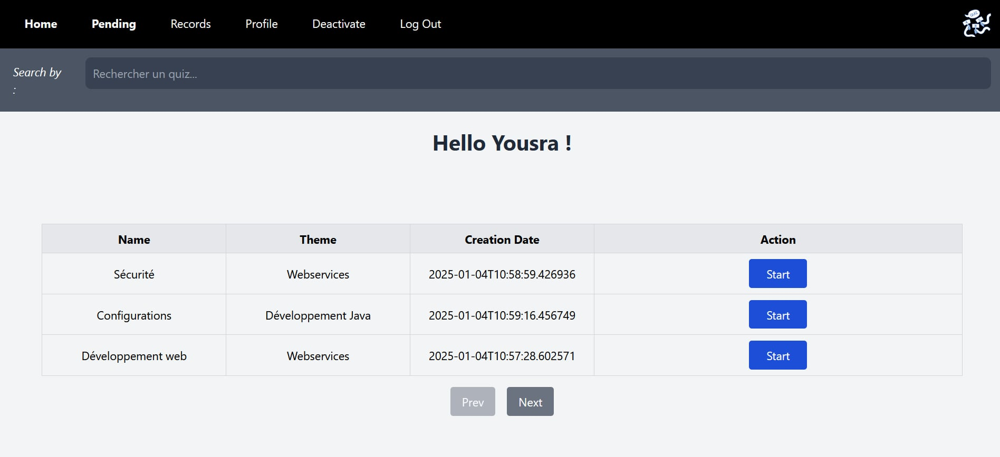
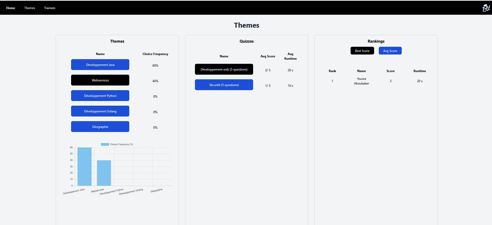

# QuizApp

Une application de quiz interactive développée en Java pour tester les compétences des stagiaires


## Fonctionnalités

- Affichage d’une série de questions à choix multiples
- Évaluation automatique du score
- Navigation entre les questions
- Affichage du résultat final
- Statistique des résultats

## Technologies utilisées

- **Backend** : API REST (Spring Boot)
- **Frontend** : React.js avec Tailwind CSS
- **Sécurité** : Spring Security


## Structure du projet
```text
QuizApp/
├── src/
│   └── quiz/
│       ├── Main.java
│       ├── Question.java
│       ├── Quiz.java
│       └── QuizFrame.java
├── README.md
└── ...
 ```

## Comment exécuter le projet

1. **Cloner le dépôt** :

```bash
git clone https://github.com/ton-utilisateur/QuizApp.git
cd QuizApp
 ```
## Compiler et exécuter avec java
```bash
javac src/quiz/*.java
java -cp src quiz.Main
 ```
## Aperçu
Quelque photos de l'application : 

- Page de bienvenue



- Les quizs d'un stagiaire



- Les résultats et les statistiques

